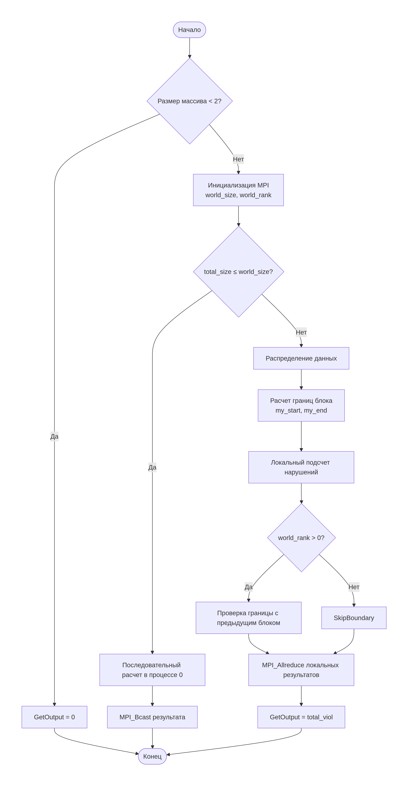

# Нахождение числа нарушений упорядоченности соседних элементов вектора

-  Student: Олесницкий Владимир Тарасович, group 3823Б1ПР2
-  Technology: SEQ | MPI
-  Variant: 1

## 1. Introduction

 - Brief motivation: познакомиться с Open MPI, освоить способы разработки параллельных программ.
 - Problem context: разработка параллельных программ представляет собой большую сложность нежели создание последовательных, однако параллельная реализация в некоторых случаях даёт ощутимый выигрыш по производительности, что делает этот инструмент необходимым для изучения. 
 - Expected outcome: я получу базовые навыки в разработке параллельных программ с помощью средств Open MPI.
## 2. Problem Statement
 - Formal task definition: необходимо написать последовательную и параллельную, использующую средства Open MPI, программы, которые позволят найти число нарушений упорядоченности соседних элементов вектора. Сравнить скорости работы    полученных реализаций, а так же проверить их валидность посредством Func и Perf тестов.
 - input/output format: на вход программе дается вектор, состоящий из чисел типа double. На выход подаётся число int, равное количеству пар соседних элементов, в котором левое число больше правого.
## 3. Baseline Algorithm (Sequential)
Если на вход подаётся вектор, чей размер не превосходит 2, программа сразу даёт ответ 0.
В ином случае, в цикле проходимся от первого элемента до предпоследнего, сравнивая текущий элемент с его правым соседом. Если результатом сравнения служит знак >, то увеличиваем счётчик неупорядоченных пар на 1. (при сравнение чисел типа double необходимо сравнивать их разность с достаточно малым числом - epsilon)

## 4. Parallelization Scheme
 -  Data distribution: 
```cpp
total_size, world_size, world_rank;
int base_chunk = total_size / world_size;
int remainder = total_size % world_size;
int my_start = world_rank * base_chunk + min(world_rank, remainder);
int my_end = my_start + base_chunk + (world_rank < remainder ? 1 : 0);
```
 - Rank roles:
	 - Process 0:
		 - Обработка маленьких массивов
		 - Рассылка данных через MPI_Bcast
	 -  All processes:
		 - Локальный подсчёт нарушений в своём блоке
		 - Проверка граничных элементов (кроме process 0)
		 - Участие в MPI_Allreduce


## 5. Implementation Details
-  Code structure (files, key classes/functions): функции ValidationImpl, PreProcessingImpl, PostProcessingImpl по сути не используются - всегда возвращается true. Вся логика содержится в функции:
 ```cpp
bool OlesnitskiyVFindViolMPI::RunImpl() {
  if (GetInput().size() < 2) {
    GetOutput() = 0;
    return true;
  }
  const auto &input_data = GetInput();
  const double epsilon = 1e-10;
  int world_size = 0;
  int world_rank = 0;
  MPI_Comm_size(MPI_COMM_WORLD, &world_size);
  MPI_Comm_rank(MPI_COMM_WORLD, &world_rank);
  int total_size = static_cast<int>(GetInput().size());
  MPI_Comm_size(MPI_COMM_WORLD, &world_size);
  MPI_Comm_rank(MPI_COMM_WORLD, &world_rank);
  if (total_size <= world_size) {
    int viol = 0;
    if (world_rank == 0) {
      for (int i = 0; i < static_cast<int>(input_data.size()) - 1; i++) {
        if (input_data[i] - input_data[i + 1] > epsilon) {
          viol++;
        }
      }
    }
    MPI_Bcast(&viol, 1, MPI_INT, 0, MPI_COMM_WORLD);
    GetOutput() = viol;
    return true;
  }
  int base_chunk = total_size / world_size;
  int remainder = total_size % world_size;
  int my_start = 0;
  my_start = (world_rank * base_chunk) + std::min(world_rank, remainder);
  int my_end = my_start + base_chunk + (world_rank < remainder ? 1 : 0);
  int local_viol = 0;
  for (int i = my_start; i < my_end - 1; i++) {
    if (input_data[i] - input_data[i + 1] > epsilon) {
      local_viol++;
    }
  }
  if (world_rank > 0) {
    if (input_data[my_start - 1] - input_data[my_start] > epsilon) {
      local_viol++;
    }
  }
  int total_viol = 0;
  MPI_Allreduce(&local_viol, &total_viol, 1, MPI_INT, MPI_SUM, MPI_COMM_WORLD);
  GetOutput() = total_viol;
  return true;
}
```
-  Important assumptions and corner cases: если на вход подаётся вектор длины меньше 2 - это не считается ошибкой, при этом сразу выдаётся ответ 0.
-  Memory usage considerations: в изначальной реализации доступ к GetInput() имел только нулевой процесс, он же производил разбиение последующих элементов на блоки и последующую их рассылку. С целью уменьшить время работы программы я  от этого отказался и теперь у каждого процесса есть доступ к памяти GetInput(), однако работают они только со своим блоком и концом предыдущего блока.

## 6. Experimental Setup
-  Hardware/OS: CPU model, cores/threads, RAM, OS version:
	- Модель ЦП: AMD Ryzen 5 5600H with Radeon Graphics
	- Архитектура: x86_64
	- Ядра/потоки: 6 ядер, 12 потоков
	- ОЗУ: 16 ГБ (14 GiB доступно, 15695392 kB)
	- Версия ОС: Ubuntu 22.04.5 LTS (jammy)
	- Ядро: Linux 6.8.0-87-generic
-  Toolchain: 
	- GCC 13.1.0 (Ubuntu 13.1.0-8ubuntu1~22.04)
	- Clang 17.0.6 (AMD AOCC 5.0.0)
	- CMake 4.1.2
	- GNU Make 4.3

## 7. Results and Discussion

### 7.1 Correctness
Корректность работы была проверена с помощью комплексного модульного тестирования с использованием фреймворка Google Test. Набор тестов включал 20 тестовых случаев, охватывающих различные сценарии:
```
const std::array<TestType, 10> kTestParam = {
    std::make_tuple(std::vector<double>{}, 0, "empty"),
    std::make_tuple(std::vector<double>{1.0}, 0, "single"),
    std::make_tuple(std::vector<double>{1.0, 2.0, 3.0, 4.0, 5.0}, 0, "sorted_asc"),
    std::make_tuple(std::vector<double>{5.0, 4.0, 3.0, 2.0, 1.0}, 4, "sorted_desc"),
    std::make_tuple(std::vector<double>{1.0, 3.0, 2.0, 5.0, 4.0}, 2, "mixed"),
    std::make_tuple(std::vector<double>{1.0, 2.0, 2.0, 3.0, 3.0}, 0, "duplicates"),
    std::make_tuple(std::vector<double>{1.0, 1.0 + 1e-11, 1.0 + 1e-9}, 0, "precision_low"),
    std::make_tuple(std::vector<double>{1.0, 1.0 - 1e-8, 1.0 - 2e-8}, 2, "precision_high"),
    std::make_tuple(std::vector<double>{1.0, 2.0}, 1, "two_numbers"),
    std::make_tuple(std::vector<double>{3.0, 1.0, 2.0}, 1, "three_numbers")};
```
Все тесты прошли успешно (20/20) со временем выполнения 0 мс на тест, что подтверждает правильность подсчета нарушений для обеих реализаций: последовательной (SEQ) и MPI.


### 7.2 Performance
Present time, speedup and efficiency. Example table:

| Mode        | Count | Time, s | Speedup | Efficiency |
|-------------|-------|---------|---------|------------|
| seq         | 1     |   0.0653056145 | 1.00    | N/A        |
| seq         | 1     | 0.0653569698   | 1.00    | N/A        |
| omp         | 4     | 0.0184350826   |   3.54  |   88.5%    |
| omp         | 4     | 0.0184184014   |   3.55  |   88.8%    |
Реализация MPI показывает стабильное ускорение около 3.545 по сравнению с последовательной версией. При этом оба режима (pipeline(выше) и task_run(ниже)) показывают практически идентичную производительность для каждой реализации.
Эта задача показывает хороший параллелизм т.к. данные независимы между собой, узким местом препятствующим ещё большему разрыву между последовательной и параллельными версиями я бы указал разве что малое количество математических операций) 


## 8. Conclusions
Summarize findings and limitations.

## 9. References
1. [Учебные материалы](https://disk.yandex.ru/d/NvHFyhOJCQU65w)

## Appendix (Optional)
```cpp
// Short, readable code excerpts if needed
```
